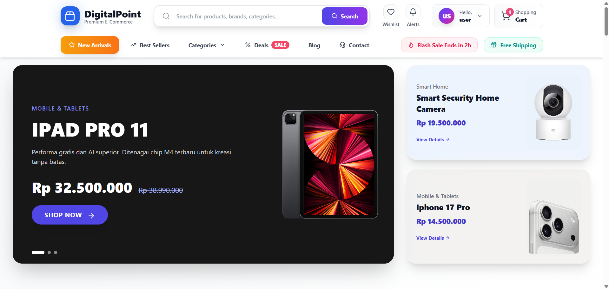
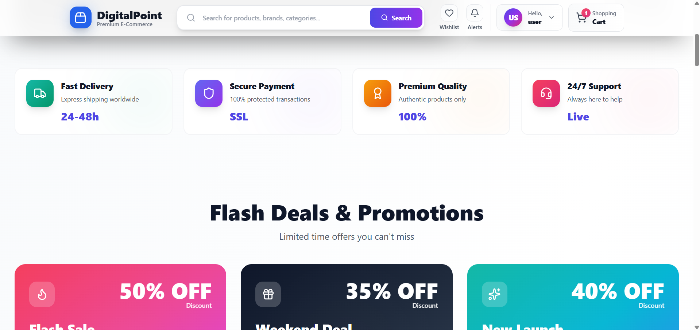
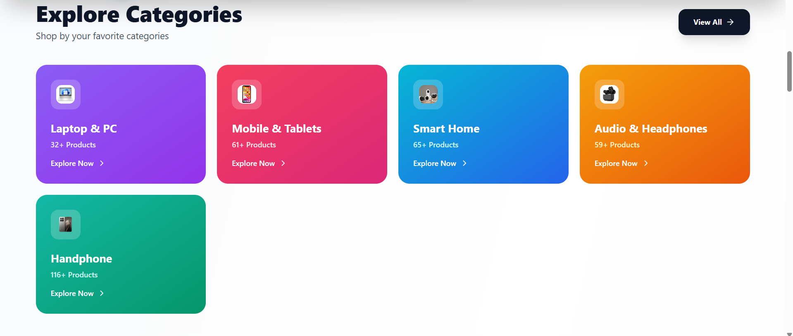
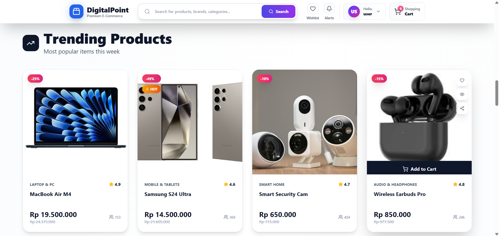
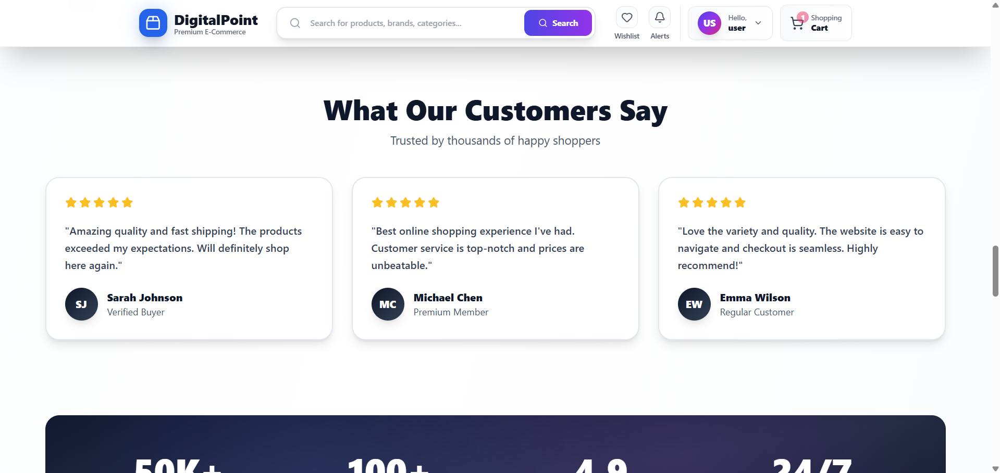

# Ecommerce Toko Elektronik

## Informasi Proyek
**Nama:** Aliman Fijar Buana  
**NIM:** 312210664  
**Mata Kuliah:** UAS Bisnis Elektronik  
**Deskripsi:** Website Ecommerce Toko Elektronik menggunakan Yii Framework (Backend) dan React (Frontend)

---

## 📱 Tentang Aplikasi
Website Ecommerce Toko Elektronik adalah platform jual beli produk elektronik online yang dikembangkan dengan teknologi modern. Aplikasi ini menyediakan fitur lengkap untuk mengelola produk, keranjang belanja, dan transaksi pembelian.

---

## 🎥 Video Demo
📹 **Tonton demo aplikasi di YouTube:**  

[](https://youtu.be/nuF0r0eYxEE)

> 🎬 **[Tonton Video Demo Lengkap di YouTube](https://youtu.be/nuF0r0eYxEE)**

---

## 🛠️ Teknologi yang Digunakan

### Backend
- **Yii Framework** - PHP Framework untuk RESTful API
- **MySQL** - Database Management System

### Frontend
- **React.js** - JavaScript Library untuk UI
- **Axios** - HTTP Client untuk API calls
- **React Router** - Routing management

---

## 📸 Screenshot Aplikasi

### Halaman Utama


### Katalog Produk


### Detail Produk


### Keranjang Belanja


### Checkout


---

## ✨ Fitur Utama
- 🏠 **Homepage** - Tampilan landing page menarik dengan produk unggulan
- 🛍️ **Katalog Produk** - Menampilkan berbagai produk elektronik
- 🔍 **Pencarian Produk** - Fitur search untuk menemukan produk
- 🛒 **Keranjang Belanja** - Manajemen item yang akan dibeli
- 💳 **Checkout** - Proses pembayaran yang mudah
- 👤 **Manajemen User** - Registrasi dan login pengguna
- 📦 **Riwayat Pesanan** - Tracking pembelian

---

## 🚀 Cara Instalasi

### Prerequisites
- PHP >= 7.4
- Composer
- Node.js & NPM
- MySQL

### Backend Setup
```bash
cd backend
composer install
php yii migrate
php yii serve
```

### Frontend Setup
```bash
cd frontend
npm install
npm start
```

---

## 📂 Struktur Proyek
```
.
├── backend/           # Yii Framework API
│   ├── controllers/   # API Controllers
│   ├── models/        # Database Models
│   └── config/        # Configuration files
├── frontend/          # React Application
│   ├── src/
│   │   ├── components/
│   │   ├── pages/
│   │   └── services/
│   └── public/
├── home1.png          # Screenshot 1
├── home2.png          # Screenshot 2
├── home3.png          # Screenshot 3
├── home4.png          # Screenshot 4
└── home5.png          # Screenshot 5
```

---

## 📝 Cara Upload Video ke YouTube
1. Login ke YouTube Studio
2. Klik tombol "CREATE" > "Upload videos"
3. Pilih file video demo aplikasi
4. Isi judul: "Demo Ecommerce Toko Elektronik - UAS Bisnis Elektronik"
5. Tambahkan deskripsi dan tags
6. Publish video
7. Copy link video dan update README

---

## 👨‍💻 Developer
Dikembangkan oleh **Aliman Fijar Buana** (312210664)  
Universitas Pelita Bangsa  
Tahun 2025

---

## 📄 Lisensi
Project ini dibuat untuk keperluan akademik UAS Bisnis Elektronik.

---

## 🙏 Terima Kasih
Terima kasih kepada:
- Dosen Pembimbing Mata Kuliah Bisnis Elektronik
- Tim pengembang Yii Framework dan React.js
- Semua pihak yang telah mendukung pengembangan aplikasi ini

---

**⭐ Jika project ini bermanfaat, jangan lupa berikan star di repository ini!**
